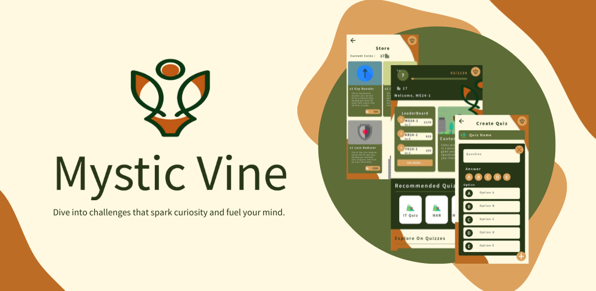

# MysticVine

Mystic Vine is a quiz adventure game where you collect experience points and earn in-game currency as you progress through quizzes made by your friends. Every correct answer brings you closer to unlocking new power-ups, leveling up your skills, and enhancing your gameplay. Play with your friends in a custom game and have fun creating custom questions to learn more about them!

## Project overview

- Package namespace: `edu.bluejack24_1.mysticvine`
- Minimum SDK: 33
- Target/Compile SDK: 34
- Languages: Kotlin, XML (Android layouts & resources)
- Build system: Gradle + Kotlin DSL
- Firebase: Realtime Database, Authentication, Storage (configured via `app/google-services.json`)

## Repository layout

- `app/` - Android application module
  - `build.gradle.kts` - module Gradle config
  - `google-services.json` - Firebase configuration for debug/dev (check keys before shipping)
  - `src/main/` - app source code and resources
- `gradle/` - Gradle wrapper and version coordinates
- `build.gradle.kts`, `settings.gradle.kts` - top-level Gradle configuration

## Prerequisites

- JDK 11 or newer installed. Set `JAVA_HOME` to your JDK installation directory.
- Android SDK with API level 33/34 installed and `ANDROID_HOME` or Android Studio configured.
- Gradle wrapper is included; you don't need a global Gradle installation.
- Optional: Android Studio (recommended) — open the project folder to import Gradle settings.

## Firebase configuration

`app/google-services.json` contains API keys and project ids for Firebase. This file is checked into the repository for development convenience.

Important security note:
- The included `google-services.json` contains API keys that are intended for client-side use. Do NOT commit server API keys or other secrets. Consider using different Firebase projects/keys for production.

Firebase configuration details
- This project was configured with Firebase using Android Studio's Firebase tools (the "Firebase Assistant" / project configuration UI). The `google-services.json` file was generated when the app was connected to the Firebase project via Android Studio and then placed into `app/`.

How to reconfigure or add Firebase services (via Android Studio)
1. Open the project in Android Studio.
2. Open the Firebase tool window (Tools > Firebase) or use the Assistant panel.
3. Sign in with your Google account and select the appropriate Firebase project.
4. Follow the guided steps to enable services (Authentication, Realtime Database, Storage, etc.).
5. When you connect an Android app in the Firebase console/Assistant, download the updated `google-services.json` and place it in the `app/` folder.
6. Sync the project (Android Studio will prompt to add the required Gradle plugins and dependencies).

